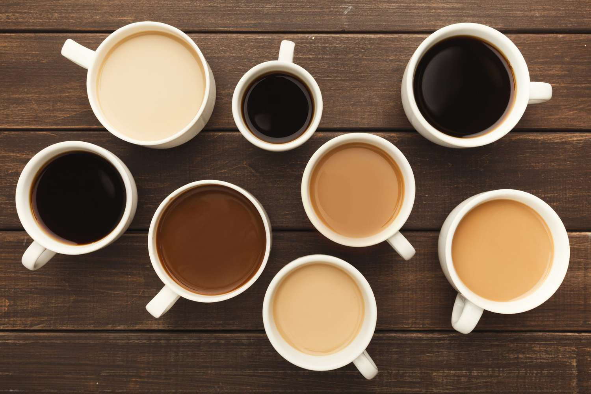

<html>

<body style="background-color: cyan;">
  
<h1 align="center"></h1>
 <h2>How to make a cup of coffee</h2>
    
 
Making a simple cup of coffee can often make or break someone's day, so let's start by 
      attempting to make it a good one with a good cup of coffee
         
        Ingredients
      <ol>
  <li>Coffee</li>
  <li>Water</li>
</ol>

  Feel free to add any flavoring or creams as desired AFTER the coffee has been properly brewed :) 
    

    <!--I'm a note, I'm a note, I am very notey note -->
    

    <h3>Steps</h3>
    

       After you have prepared your brewing choice of caffinated goodness, and your setup is compelete its time to start up that coffee maker!
        

        <ul>
  <li>Usng 1TBLS for every 2 cups, scoop your grounds into your filter</li>
  <li>Make sure your brewer has cold water provided; it will heat up as it brews</li>
  <li>Flip the "ON" switch and sit back and wait</li>
</ul>

Making a cup too strong is technically a choice, but only some enjoy overly flavorful coffee. So it's important to use your preferred coffee-to-water ratio regularly
and get the hang of a set amount to make a good taste and caffeine. But as mentioned, its entirely up to you, if you enjoy a coffee so strong that you cringe, by all means!
    

<h4>
  

    For more coffee tips and tricks, click the link below!
  

</h4>
 <h5>
   <li>Visit ourCoffee</a></li>
 </h5>

</body>
</html>
